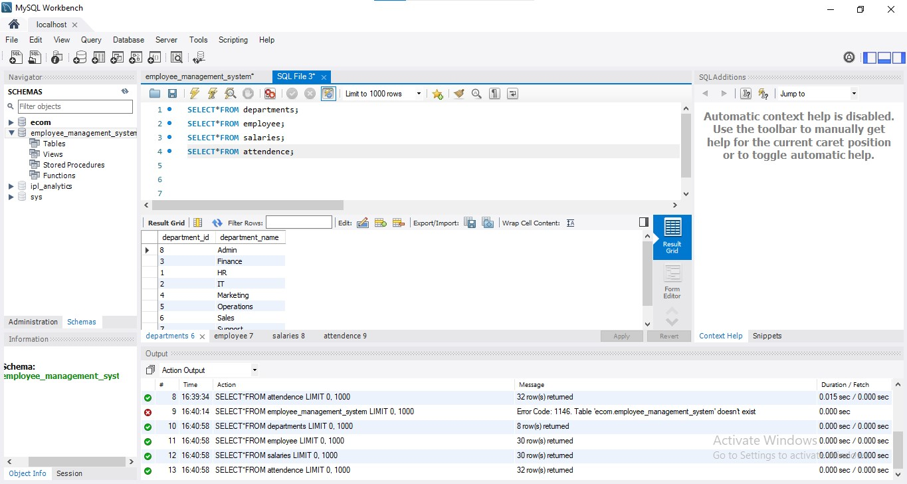
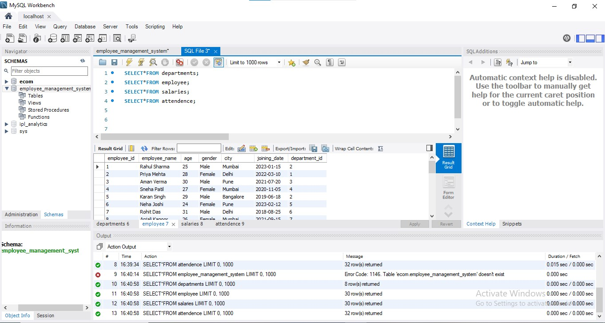
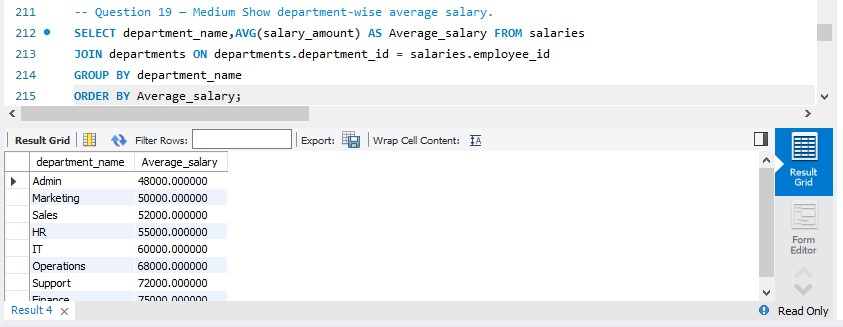
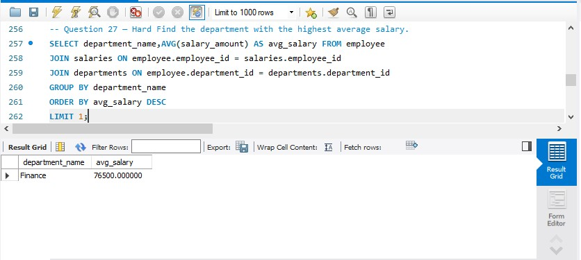

# Employee-Management-System-SQL
SQL-based employee management analytics project using MySQL

# Employee Management System SQL Project

## Overview

A MySQL-based Employee Management System designed to manage employee records, department information, salary details, and attendance tracking.

This project demonstrates relational database design and SQL analytics using realistic business scenarios.

---

## Database Tables

### Departments
Stores department information.

### Employee
Stores employee details such as name, age, gender, city, joining date and department assignment.

### Salaries
Stores employee salary and bonus information.

### Attendance
Stores employee attendance records and status.

---

## SQL Concepts Used

- SELECT Statements
- WHERE Clause
- ORDER BY
- GROUP BY
- HAVING Clause
- INNER JOIN
- LEFT JOIN
- Aggregate Functions
- Subqueries
- Window Functions
- Views

---

## Business Questions Solved

- Department-wise employee count
- Attendance status analysis
- Department-wise average salary
- Highest salary department
- Employee salary ranking
- Above-average salary analysis
- Payroll insights

---

## Tools Used

- MySQL
- MySQL Workbench

---

## Project Structure

employee_management_system.sql

Contains:
- Database Creation
- Table Creation
- Sample Data
- SQL Queries
- Analytical Queries
- Views

---
## Project Screenshots

### Database Tables

### Employee Data

### Department Average Salary

### Highest Average Salary Department

## Author

Armaan Tiwari

B.Sc Computer Science | Mumbai University

Aspiring Data Analyst
